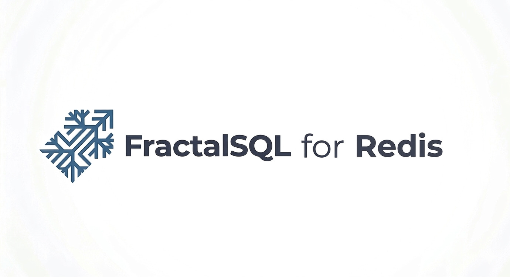

<p align="center">
  
</p>

# FractalSQL for Redis

**Sub-millisecond semantic search as a Redis module.**
A single `FRACTAL.SEARCH` command, a stored-BLOB corpus, a query
vector, and a RESP3 map back — all running inside the server
process, with LuaJIT statically linked into the module.

One `fractalsql.so` per arch covers every supported Redis major.
The Redis Modules ABI (`REDISMODULE_APIVER_1`) has been stable
since Redis 4.0, so the same binary loads cleanly on 6.2 / 7.0 /
7.2 / 7.4 (and 8.x). On Windows the target is
[Memurai](https://www.memurai.com) — the current production-quality
Redis-compatible Windows server, since Redis Labs abandoned its
official Windows port in 2016 and Microsoft's MSOpenTech fork is
dead.

## Compatibility

| Redis / Memurai       | Linux amd64 | Linux arm64 | Windows x64 (Memurai) | Windows arm64 |
|-----------------------|-------------|-------------|-----------------------|---------------|
| Redis 6.2             |      ✓      |      ✓      |           —           |       —       |
| Redis 7.0             |      ✓      |      ✓      |           —           |       —       |
| Redis 7.2 / Memurai 4 |      ✓      |      ✓      |           ✓           |       —       |
| Redis 7.4             |      ✓      |      ✓      |           —           |       —       |

Windows ARM64 and 32-bit cells are deferred — Memurai does not yet
publish binaries for those targets.

---

## The command surface

```
FRACTAL.SEARCH       <corpus_key> <query_blob> [<K>]
FRACTALSQL.EDITION
FRACTALSQL.VERSION
```

| Arg | Type | Notes |
| --- | --- | --- |
| `corpus_key` | Redis STRING key | Packed little-endian float32 values, `N * dim * 4` bytes |
| `query_blob` | RESP bulk string | Packed little-endian float32 query vector, `dim * 4` bytes (dim is inferred) |
| `K`          | integer, optional | Top-k to return (default 10, clamped to [1, 10000]) |

Reply from `FRACTAL.SEARCH` is a RESP3 map (auto-downgrades to a
RESP2 array of key/value pairs for clients that don't speak RESP3):

```json
{
  "dim":        128,
  "n_corpus":   10000,
  "best_point": [0.601, 0.598, ...],
  "best_fit":   0.00009,
  "top_k": [
    {"idx": 42,   "dist": 0.012},
    {"idx": 1337, "dist": 0.019}
  ]
}
```

`FRACTALSQL.EDITION` returns `"Community"`.
`FRACTALSQL.VERSION` returns `"1.0.0"`.

### Zero-copy semantics

The corpus is read via `RedisModule_StringDMA`, and cosine
distance is computed directly on the Redis-owned memory cast as
`const float *`. The query is likewise accessed via
`RedisModule_StringPtrLen` with no intermediate copy.

### Thread model

`FRACTAL.SEARCH` is declared `readonly fast allow-stale`. Each
thread that executes it lazily constructs its own LuaJIT state
(`__thread`-local) on first call and never tears it down, so
there is no cross-thread mutex in the hot path.

---

## Install — Linux (Debian / Ubuntu)

```bash
sudo apt install ./redis-fractalsql-amd64.deb
# Add to /etc/redis/redis.conf:
#     loadmodule /usr/lib/redis/modules/fractalsql.so
# Or include the shipped snippet:
#     include /etc/redis/modules-available/fractalsql.conf
sudo systemctl restart redis-server

redis-cli FRACTALSQL.EDITION      # -> "Community"
redis-cli FRACTALSQL.VERSION      # -> "1.0.0"
redis-cli MODULE LIST
```

Depends on `redis-server` generically (no version pin — one binary
covers 6.2 / 7.0 / 7.2 / 7.4). LuaJIT is statically linked; the
package declares no `libluajit` dependency.

## Install — Linux (RHEL / Fedora / Oracle Linux)

```bash
sudo rpm -i redis-fractalsql-x86_64.rpm
# Edit /etc/redis/redis.conf per above, then:
sudo systemctl restart redis

redis-cli FRACTALSQL.EDITION
redis-cli FRACTALSQL.VERSION
```

Requires `redis`. The spec claims `%dir` ownership of
`/usr/lib/redis/modules/` and `/etc/redis/modules-available/`
since neither is owned by a base package on stock RHEL-family
installs.

## Install — Live load (either distro)

```bash
redis-cli MODULE LOAD /usr/lib/redis/modules/fractalsql.so
```

Doesn't persist across server restarts — use the config path above
for production.

## Install — Windows (Memurai)

```powershell
# Interactive (Welcome / EULA / folder picker / ready / progress):
msiexec /i FractalSQL-Memurai-4-1.0.0-x64.msi

# Silent, auto-appending loadmodule to memurai.conf (the default):
msiexec /i FractalSQL-Memurai-4-1.0.0-x64.msi /qn

# Silent, skipping the memurai.conf edit:
msiexec /i FractalSQL-Memurai-4-1.0.0-x64.msi /qn ADDLOADMODULE=0

# Targeting a non-default Memurai install root:
msiexec /i FractalSQL-Memurai-4-1.0.0-x64.msi /qn MEMURAIROOT="D:\Memurai"

# Restart Memurai after install (the installer does NOT auto-restart):
Restart-Service Memurai

memurai-cli FRACTALSQL.EDITION      # -> "Community"
memurai-cli FRACTALSQL.VERSION      # -> "1.0.0"
memurai-cli MODULE LIST
```

The MSI auto-detects the Memurai install root from
`HKLM\SOFTWARE\Memurai\InstallPath` and installs:

```
<MEMURAIROOT>\modules\fractalsql.dll
<MEMURAIROOT>\share\doc\redis-fractalsql\LICENSE
<MEMURAIROOT>\share\doc\redis-fractalsql\LICENSE-THIRD-PARTY
<MEMURAIROOT>\share\doc\redis-fractalsql\README.txt
<MEMURAIROOT>\share\doc\redis-fractalsql\load_module.conf
```

When `ADDLOADMODULE=1` (the default), the installer idempotently
appends a `loadmodule` directive to `<MEMURAIROOT>\memurai.conf`.
The Memurai service is **not** restarted by the installer —
scheduling the restart is the operator's call on a shared host.

### About Memurai

[Memurai](https://www.memurai.com/) is the production-quality,
Redis-API-compatible server for Windows. Redis Labs dropped its
official Windows port in 2016 and Microsoft's MSOpenTech fork is
unmaintained; Memurai is the current actively-developed alternative
and implements the Redis Modules API natively, which is what makes
this MSI possible.

Memurai Developer is **free for non-production use**; production
deployments require a commercial license. See
[memurai.com](https://www.memurai.com/) for licensing details.
Memurai itself is not bundled in this MSI — install Memurai from
memurai.com first, then install this MSI on top.

---

## Example usage

```bash
# Store a corpus of 1000 × 128-dim float32 embeddings as a BLOB.
redis-cli SET my_corpus "$(cat embeddings.bin)"

# Query.
redis-cli FRACTAL.SEARCH my_corpus "$(cat query.bin)" 10
```

Python (redis-py, RESP3 map replies):

```python
import redis
import numpy as np

r = redis.Redis(protocol=3)

corpus = np.random.randn(10_000, 128).astype(np.float32)
r.set("my_corpus", corpus.tobytes())

query = np.random.randn(128).astype(np.float32)
resp = r.execute_command("FRACTAL.SEARCH", "my_corpus", query.tobytes(), 10)
# resp is a dict: {b'dim': 128, b'n_corpus': 10000, 'best_point': [...],
#                  'best_fit': 0.001, 'top_k': [{'idx': 42, 'dist': 0.012}, ...]}
```

---

## Build from source

```bash
./build.sh amd64   # -> dist/amd64/fractalsql.so (static LuaJIT, zero-deps posture)
./build.sh arm64   # -> dist/arm64/fractalsql.so (via QEMU)
```

The Dockerfile uses `debian:bookworm-slim`, shallow-clones Redis
7.4.1 to harvest `redismodule.h`, shallow-clones LuaJIT `v2.1`,
and produces a `.so` that depends only on glibc (verified by
`docker/assert_so.sh` — ldd shortlist, no cxx11 string symbols,
`RedisModule_OnLoad` present in `.dynsym`, size under 3 MiB).

The GitHub Actions workflow loads the same `.so` into `redis:6.2`,
`redis:7.0`, `redis:7.2`, and `redis:7.4` containers on every tag
push and verifies the edition/version commands plus a cosine-
similarity convergence check.

For quick local iteration:

```bash
sudo apt install -y build-essential libluajit-5.1-dev pkg-config curl
make         # fetches redismodule.h if missing, dynamic-link LuaJIT
sudo make install
```

---

## Architectural notes

**SFS under the hood.** The module runs Sniper-mode SFS
(`walk=0.5`, pop 50, 30 iters, diffusion 2) to find a continuous
best point for the query in `[-1, 1]^dim`, then ranks the corpus
BLOB by cosine distance to that best point and returns top-k.

**No LuaJIT parser at runtime.** The optimizer ships as
pre-stripped LuaJIT bytecode embedded in the `.so` as a C byte
array (`luaJIT_BC_fractalsql_community` in `include/sfs_core_bc.h`).
Loading is a `luaL_loadbuffer` over in-memory bytes — no tokenizer,
no parser, no AST walk.

---

## Third-Party Components

See [LICENSE-THIRD-PARTY](LICENSE-THIRD-PARTY) for the full
attribution ledger. In brief:

- **Stochastic Fractal Search** core math & convergence logic,
  based on Salimi 2014 (BSD-3-Clause).
- **LuaJIT** JIT and execution engine by Mike Pall (MIT).

Memurai is **not** embedded in this distribution — it is a separate
product installed by the user.

---

## License

MIT. See [LICENSE](LICENSE).

---

[github.com/FractalSQLabs](https://github.com/FractalSQLabs) · Issues and
PRs welcome.
